# ThemesRofi
A repository for themes for the app menu rofi dmenu

<pre>
                                                         
                                                                    
  ▄▄▄▄▄▄           ▄▄      ▄▄▄▄▄▄▄                                  
 █▀██▀▀▀█▄        ██      █▀▀██▀▀▀▀ █▄                              
   ██▄▄▄█▀       ▄██▄▀▀      ██     ██          ▄                   
   ██▀▀█▄   ▄███▄ ██ ██      ██     ████▄ ▄█▀█▄ ███▄███▄ ▄█▀█▄ ▄██▀█
 ▄ ██  ██   ██ ██ ██ ██      ██     ██ ██ ██▄█▀ ██ ██ ██ ██▄█▀ ▀███▄
 ▀██▀  ▀██▀▄▀███▀▄██▄██      ▀██▄  ▄██ ██▄▀█▄▄▄▄██ ██ ▀█▄▀█▄▄▄█▄▄██▀
                  ██                                                
                 ▀▀                                                 
                                                       
</pre>
How use 
1: git clone https://github.com/1isack/ThemesRofi
2: cd ThemesRofi
3: chmod +x install.sh
4: ./install.sh 
5: chose ur theme :D
6: mkdir -p ~/.config/rofi/images and put ur image 
7: use pywall for more beatiful themes 
Made by isak follow me in tiktok @1isakzz
## Previews

| Photo |
| :--- |
| 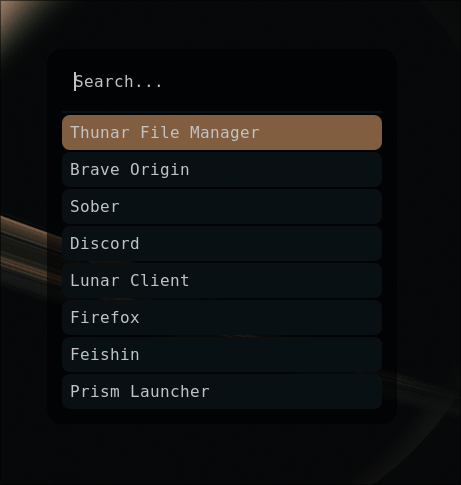 |
| 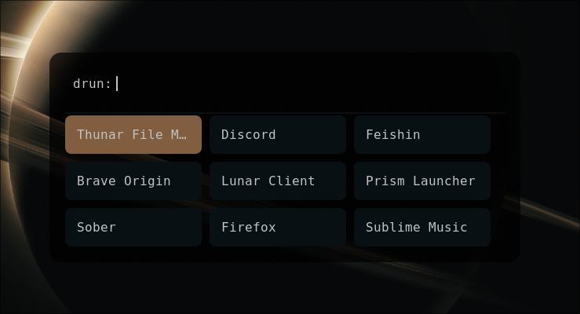 |
| 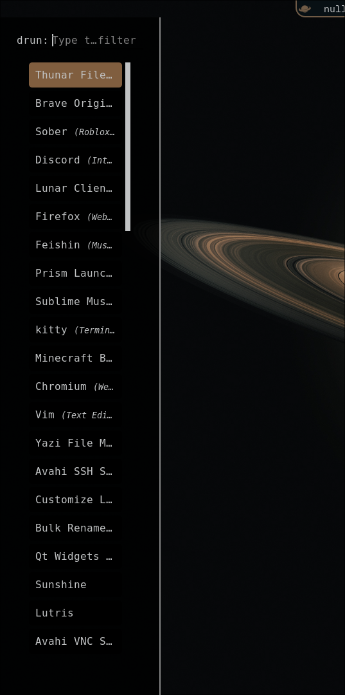 |
| 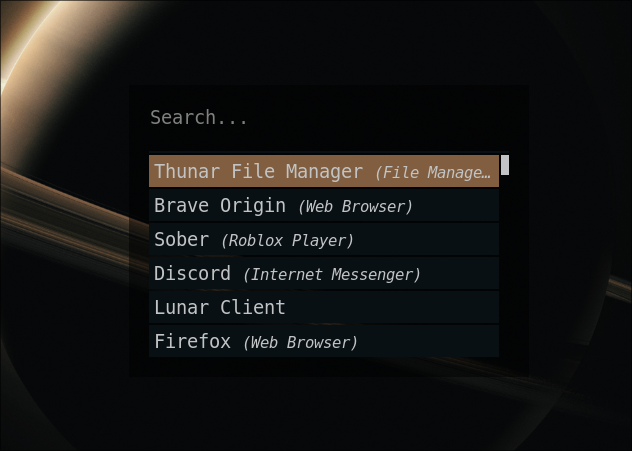 |
| 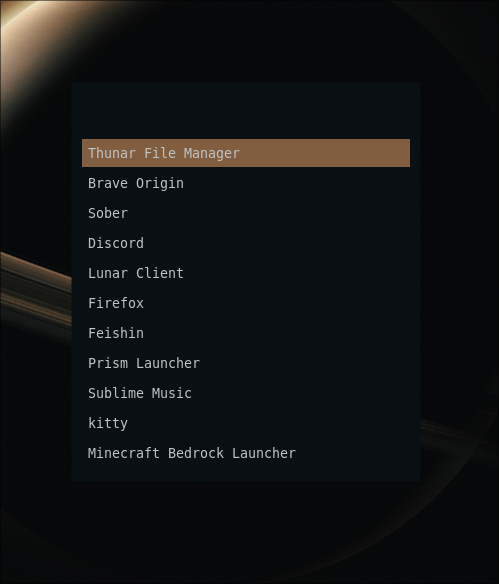 |
| 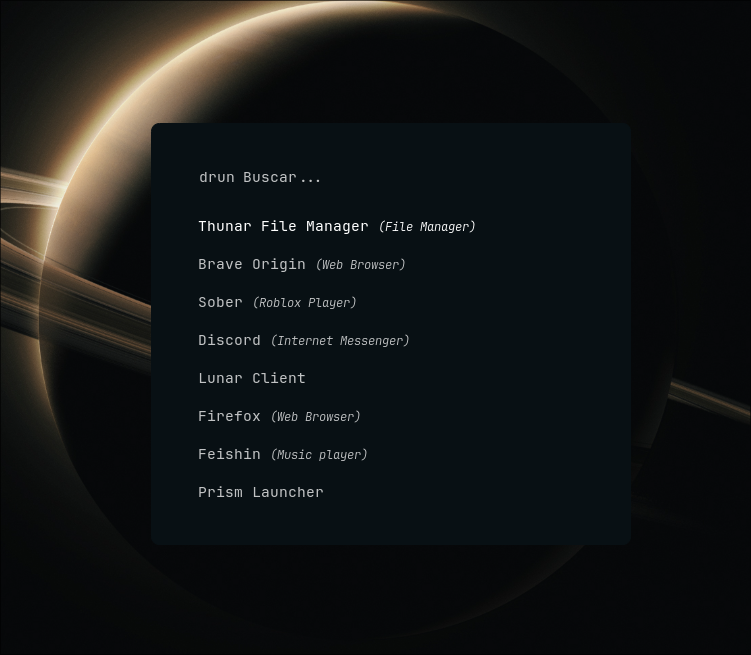 |
| 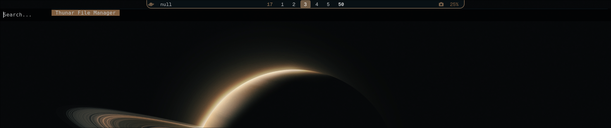 |
| 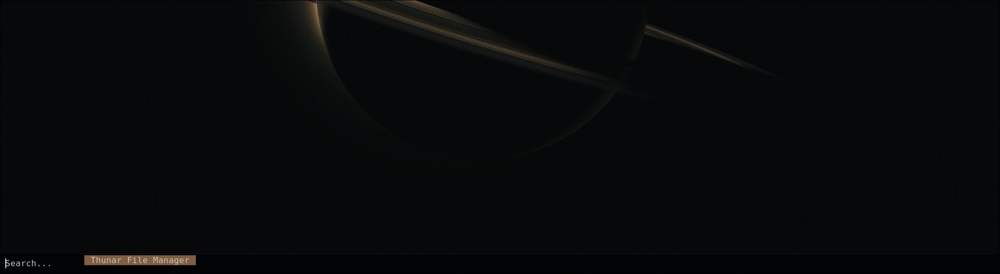 |
| 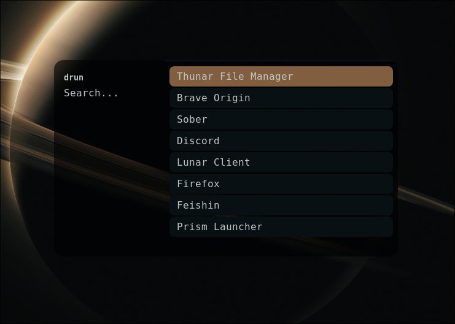 |
| 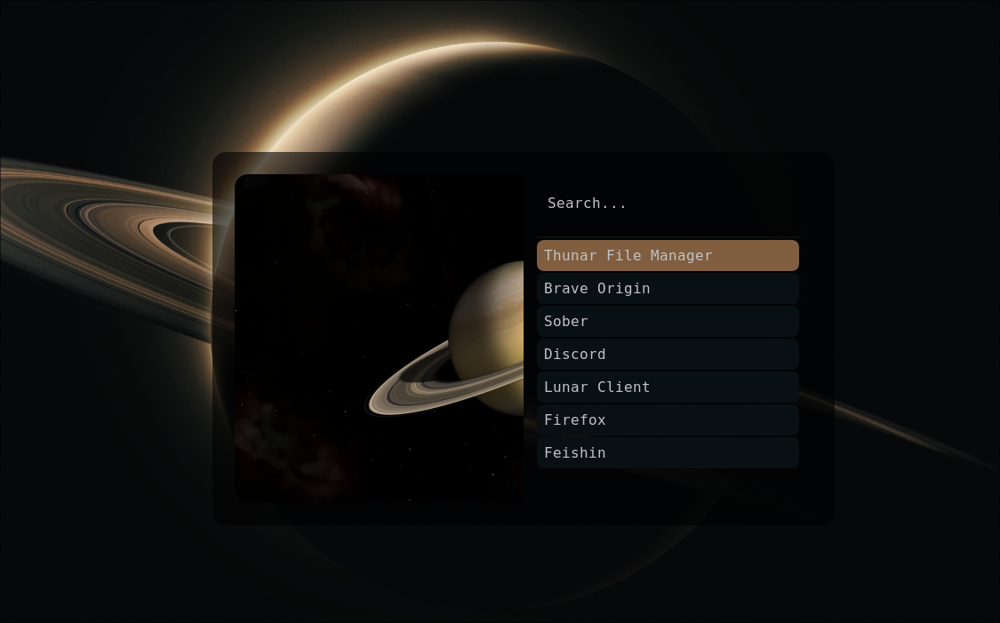 |
| 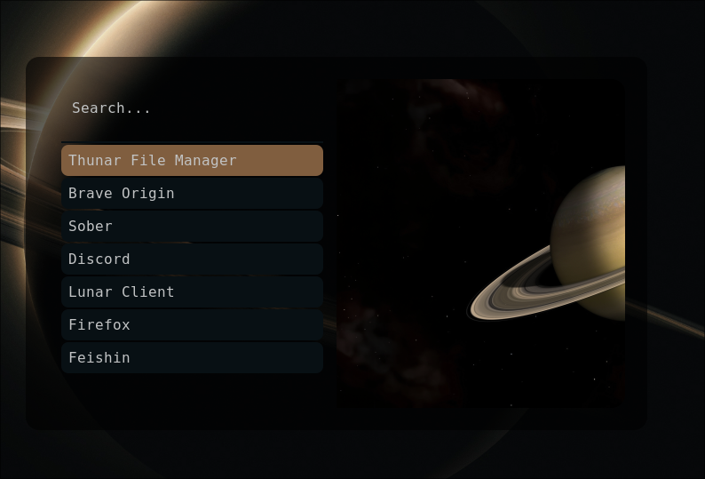 |
| 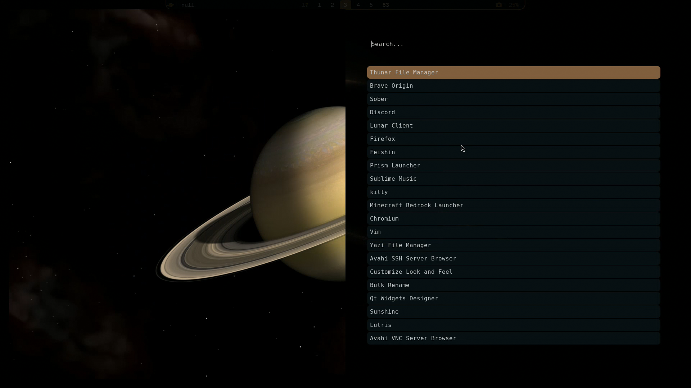 |
| 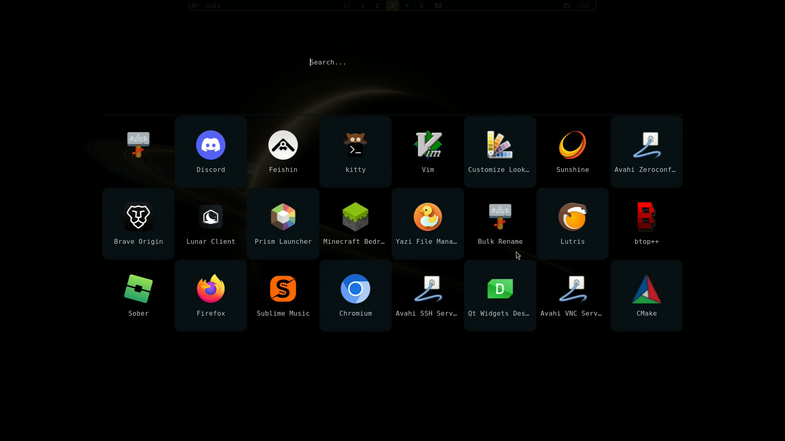 |
